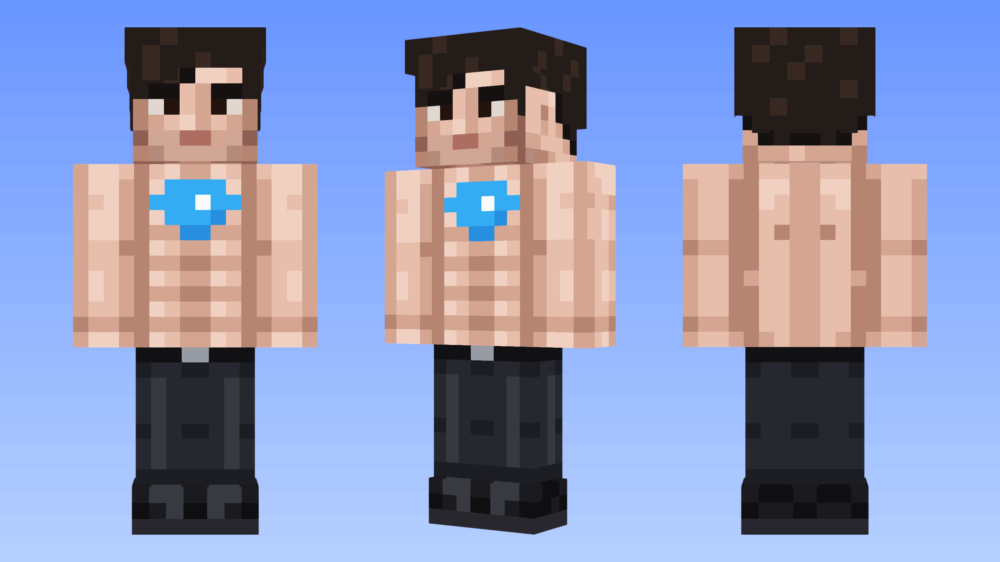
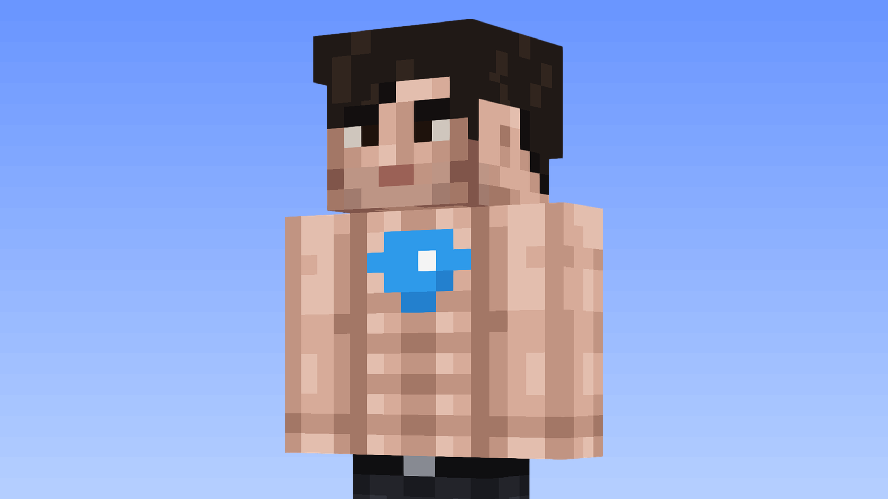
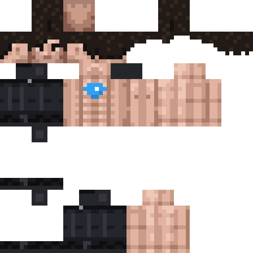

# Durov Minecraft Skin

A meme Minecraft skin of Pavel Durov: shirtless, a suspiciously perfect 8-pack, the diamond logo of GRAM (prev. TON) on the chest, black pants and black boots.

## Download

**[durov.png](https://github.com/necrovolt/durov-skin/raw/main/durov.png)** (64×64, standard skin format)

## Install

Use the **Classic** model (Steve, 4 px arms). With the Slim model the arms will look wrong.

**Java Edition, Minecraft Launcher**

1. Open the Minecraft Launcher and go to **Skins**.
2. Click **New skin**, give it a name and choose **Classic**.
3. Click **Browse**, select `durov.png`, then **Save & Use**.

Tested in Java Edition. Bedrock Edition accepts the same 64×64 format, but the skin has not been tested there.

## What's inside

| Part | Details |
|---|---|
| **Face** | Side-swept fringe, heavy stare, light stubble. The face is only 8×8 pixels, so it is a caricature, not a portrait. |
| **Chest** | Diamond logo of GRAM (prev. TON), centered. |
| **Abs** | Eight identical cubes. Suspiciously identical. |
| **Outfit** | Black pants with a belt and black boots. |
| **Second layer** | Hair volume and slightly bulkier boots. |

## Credits

Created by [Vibes 18+](https://t.me/vibes).

## License

The skin and the preview images are licensed under [CC BY 4.0](https://creativecommons.org/licenses/by/4.0/). You can use, share and remix them, including in your own skins and videos, as long as you credit [Vibes 18+](https://t.me/vibes). See [LICENSE](LICENSE).

## Disclaimer

Fan art and parody. Not affiliated with or endorsed by Pavel Durov, Telegram, GRAM (TON), Mojang Studios or Microsoft. Minecraft is a trademark of Mojang Synergies AB. The GRAM name and mark belong to their respective owners.
